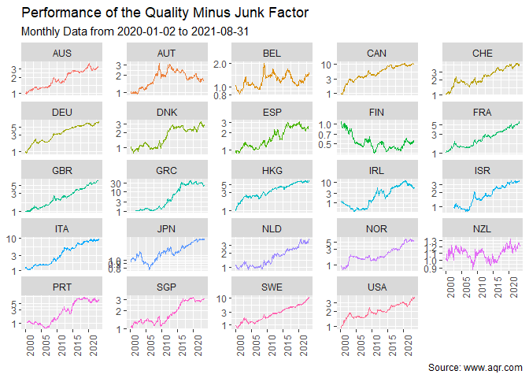

<!-- README.md is generated from README.Rmd. Please edit that file -->

# aqrr

<!-- badges: start -->

[](https://github.com/Reckziegel/aqqr/actions/workflows/R-CMD-check.yaml)
<!-- badges: end -->

Get the [datasets](https://www.aqr.com/Insights/Datasets) computed by
the AQR research team in R.

## Installation

You can install the development version of aqrr from
[GitHub](https://www.github.com/) with:

``` r
# install.packages("devtools")
devtools::install_github("Reckziegel/aqqr")
```

## Toy Example

``` r
library(dplyr)
library(ggplot2)
library(aqrr)

# Quality Minus Junk Factor
qmj <- aqr_qmj_monthly()
qmj <- na.omit(qmj)
qmj
#> # A tibble: 10,276 x 3
#>    date       name     value
#>    <date>     <chr>    <dbl>
#>  1 1957-07-31 USA    0.0112 
#>  2 1957-08-31 USA    0.00488
#>  3 1957-09-30 USA    0.00701
#>  4 1957-10-31 USA    0.00271
#>  5 1957-11-30 USA   -0.00897
#>  6 1957-12-31 USA   -0.00327
#>  7 1958-01-31 USA   -0.0252 
#>  8 1958-02-28 USA    0.00480
#>  9 1958-03-31 USA    0.0159 
#> 10 1958-04-30 USA    0.00256
#> # i 10,266 more rows
```

``` r
regions_to_exclude <- c("Global Ex USA", "North America", "Global", "Europe", "Pacific")
qmj |>
  
  # data manipulation
  filter(date >= "2000-01-02", !name %in% regions_to_exclude) |> 
  group_by(name) |> 
  na.omit() |> 
  mutate(performance = cumprod(exp(value))) |> # cumulative performance
  ungroup() |> 
  
  # plot
  ggplot(aes(x = date, y = performance, color = name)) + 
  geom_line(show.legend = FALSE) + 
  scale_y_log10() + 
  facet_wrap(~name, scales = "free_y") + 
  theme(axis.text.x = element_text(angle = 90)) + 
  labs(title    = "Performance of the Quality Minus Junk Factor", 
       subtitle = "Monthly Data from 2020-01-02 to 2021-08-31", 
       caption  = "Source: www.aqr.com", 
       x        = NULL, 
       y        = NULL)
```



## Functions

See the all available functions in the
[reference](https://reckziegel.github.io/aqrr/reference/index.html)
page.

## References

- <https://www.aqr.com>

- Asness, Cliff S. and Frazzini, Andrea and Pedersen, Lasse Heje,
  Quality Minus Junk (June 5, 2017). Available at SSRN:
  <https://ssrn.com/abstract=2312432> or
  <http://dx.doi.org/10.2139/ssrn.2312432>

- Asness, Cliff S. and Moskowitz, Tobias J. and Moskowitz, Tobias J. and
  Pedersen, Lasse Heje, Value and Momentum Everywhere (June 1, 2012).
  Chicago Booth Research Paper No. 12-53, Fama-Miller Working Paper,
  Available at SSRN: <https://ssrn.com/abstract=2174501> or
  <http://dx.doi.org/10.2139/ssrn.2174501>

- Frazzini, Andrea and Pedersen, Lasse Heje, Betting Against Beta
  (October 9, 2011). Swiss Finance Institute Research Paper No. 12-17,
  Available at SSRN: <https://ssrn.com/abstract=2049939> or
  <http://dx.doi.org/10.2139/ssrn.2049939>

- Ilmanen, Antti S. and Israel, Ronen and Moskowitz, Tobias J. and
  Moskowitz, Tobias J. and Thapar, Ashwin K and Lee, Rachel, How Do
  Factor Premia Vary Over Time? A Century of Evidence (February 18,
  2021). Available at SSRN: <https://ssrn.com/abstract=3400998> or
  <http://dx.doi.org/10.2139/ssrn.3400998>
